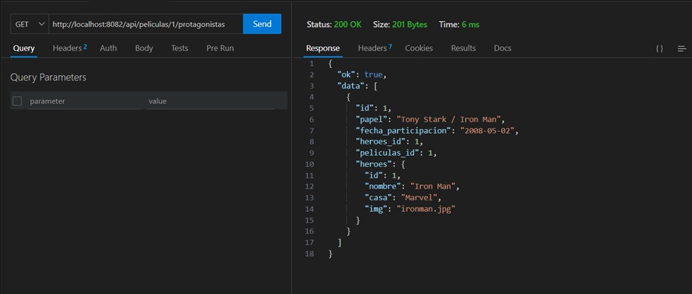
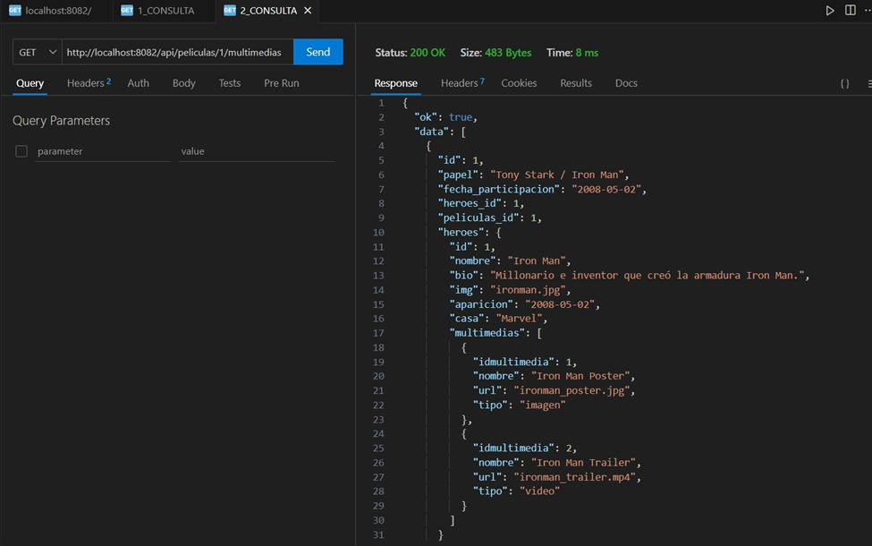

# API REST con Node.js + Express — Gestión de Héroes, Películas y Multimedia

## 📌 Actividad segundo corte Almacenación de Datos  
**Proyecto:** Ampliación de la API/REST en Node.js + Express — Gestión de Héroes, Películas y Elementos Multimedia


### Consultas adicionales (Query Endpoints)
- Por la película conocer cuales son los protagonistas de la misma, y el papel desempeñado en ella.


- Por película conocer cuales son los elementos multimedia que tiene la película a través de la asignación de los mismos a través del héroe.



---

## 📖 Descripción corta
Este repositorio contiene una API REST construida con Node.js y Express, conectada a MySQL (usando Sequelize), que gestiona héroes, películas y elementos multimedia relacionados.  
La ampliación incluye relaciones muchos-a-muchos entre:
- **Héroes y Películas** (a través de la tabla Protagonistas, especificando un rol).
- **Héroes y Multimedia** (asociando elementos como fotos/videos a héroes específicos).

También permite consultar el multimedia de las películas a través de sus héroes protagonistas, facilitando consultas complejas sobre las relaciones establecidas.

---

## 📂 Estructura del proyecto
```
├── controllers/        
│   ├── heroes.controller.js
│   ├── multimedias.controller.js
│   ├── multimediasHeroes.controller.js  
│   ├── peliculas.controller.js
│   ├── protagonistas.controller.js
│   └── usuarios.controller.js
│
├── database/           
│   └── connection.js
│
├── helpers/            
│   ├── db-validators.js
│   └── generar-jwt.js
│
├── middlewares/        
│   ├── validar-campos.js
│   ├── validar-jwt.js  
│   └── validar-roles.js
│
├── models/             
│   ├── heroes.model.js
│   ├── multimediasHeroes.model.js      
│   ├── multimedias.model.js
│   ├── peliculas.model.js
│   ├── protagonistas.model.js          
│   └── usuarios.model.js
│
├── routes/             
│   ├── heroes.route.js
│   ├── multimedias.route.js
│   ├── multimediasHeroes.route.js
│   ├── peliculas.route.js
│   ├── protagonistas.route.js
│   └── usuarios.route.js
│
├── app.js              
├── .env                
├── package.json        
└── README.md           
```

---

## ⚙️ Requisitos
- Node.js >= 18  
- MySQL >= 8  

---

## 🚀 Instalación y configuración
1. Clona el repositorio:
   ```bash
   git clone https://github.com/driosoft-pro/apirest-heroes-ds.git
   ```
   ```bash
   cd nombre-del-proyecto
   ```

2. Instala dependencias:
   ```bash
   npm install
   ```

3. Configura el archivo `.env` con las credenciales de tu base de datos y la clave secreta para JWT en el entorno local o nube según tu preferencia. Puedes basarte en `.env.example`:
   ```env
   PORT=4000
   DB_HOST=localhost
   DB_USER=root
   DB_PASSWORD=tu_password
   DB_NAME=heroesdb
   JWT_SECRET=mi_secret_key
   # Agrega las variables para la BD en la nube si las usas (DB_REMOTE_...)
   ```

4. Inicia el servidor:
   ```bash
   npm start
   ```

👉 Por defecto se levanta en: `http://localhost:4000/api`

---
## Usuarios de prueba
- **Administradores:**
  - Email: 'samuel@mail.com'
  - Contraseña: 'samuel123'
  - Nombre: 'Samuel'
  - Imagen: 'samuel.png'
  - Rol: 'ADMIN_ROLE'
  - Estado: '1'
  - Fecha de creación: '2025-01-01'
  - Fecha de actualización: '2025-02-01'

  - Email: 'sofia@mail.com'
  - Contraseña: 'sofia123'
  - Nombre: 'Sofía Ríos'
  - Imagen: 'sofia.png'
  - Rol: 'ADMIN_ROLE'
  - Estado: '1'
  - Fecha de creación: '2025-01-20'
  - Fecha de actualización: '2025-02-11'

---

- **Usuarios:**
  - Email: 'deyton@mail.com'
  - Contraseña: 'deyton123'
  - Nombre: 'Deyton'
  - Imagen: 'deyton.png'
  - Rol: 'USER_ROLE'
  - Estado: '1'
  - Fecha de creación: '2025-01-01'
  - Fecha de actualización: '2025-02-01'

  - Email: 'Lucía@mail.com'
  - Contraseña: 'lucia123'
  - Nombre: 'Lucía Gómez'
  - Imagen: 'lucia.png'
  - Rol: 'USER_ROLE'
  - Estado: '1'
  - Fecha de creación: '2025-01-01'
  - Fecha de actualización: '2025-02-01'

---

## 📌 Endpoints principales

### 👤 Usuarios
- `POST /api/usuarios` — crear un nuevo usuario.  
- `POST /api/usuarios/login` — autenticación y generación de JWT.  
- `GET /api/usuarios` — listar todos los usuarios (Ruta protegida por JWT y Rol ADMIN_ROLE).  

### 🦸‍♂️ Héroes
- `GET /api/heroes` — listar héroes  
- `GET /api/heroes/:id` — obtener héroe por ID  
- `GET /api/heroes/como/:termino` — buscar héroes por término  
- `POST /api/heroes` — crear héroe  
- `PUT /api/heroes/:id` — actualizar héroe  
- `DELETE /api/heroes/:id` — eliminar héroe  

### 🎬 Películas
- `GET /api/peliculas` — listar películas  
- `GET /api/peliculas/:id` — obtener película por ID  
- `POST /api/peliculas` — crear película  
- `PUT /api/peliculas/:id` — actualizar película  
- `DELETE /api/peliculas/:id` — eliminar película  

### 🎭 Protagonistas (Relación Héroe-Película M:M)
- `POST /api/protagonistas` — asignar héroe a película con rol (papel)  
- `GET /api/protagonistas` — listar todas las relaciones (Protagonistas)  
- `GET /api/protagonistas/:id` — obtener una relación por ID  
- `PUT /api/protagonistas/:id` — actualizar rol de la relación  
- `DELETE /api/protagonistas/:id` — eliminar relación  

### 🖼 Multimedia
- `GET /api/multimedias` — listar todo el multimedia  
- `GET /api/multimedias/:id` — detalle de un multimedia por ID  
- `POST /api/multimedias` — crear un nuevo elemento multimedia  
- `PUT /api/multimedias/:id` — actualizar multimedia  
- `DELETE /api/multimedias/:id` — eliminar multimedia  

### 🎞 Multimedia-Héroes (Relación M:M)
- `POST /api/multimediasHeroes` — asociar multimedia a un héroe  
- `GET /api/multimediasHeroes` — listar todas las asociaciones  
- `GET /api/multimediasHeroes/:id` — obtener una asociación por ID  
- `PUT /api/multimediasHeroes/:id` — actualizar asociación  
- `DELETE /api/multimediasHeroes/:id` — eliminar asociación  

---

## 🔍 Consultas adicionales (Query Endpoints)
### 📌 Por película obtener protagonistas y su rol
**GET** `/api/peliculas/:id/protagonistas`  

Ejemplo de respuesta:
```json
[
  { "hero_id": 1, "name": "Superman", "role": "Protagonista" },
  { "hero_id": 2, "name": "Batman", "role": "Secundario" }
]
```

### 📌 Por héroe obtener su multimedia asociado
**GET** `/api/heroes/:id/multimedia`  

Ejemplo de respuesta:
```json
[
  { "idmultimedia": 10, "nombre": "Foto promocional", "url": "https://cdn/.../superman.jpg", "tipo": "photo" },
  { "idmultimedia": 12, "nombre": "Clip de la película", "url": "https://cdn/.../superman-clip.mp4", "tipo": "video" }
]
```

### 📌 Por película obtener multimedia de sus héroes protagonistas
**GET** `/api/peliculas/:id/multimedia`  

Ejemplo de respuesta:
```json
[
  { "idmultimedia": 10, "tipo": "photo", "url": "https://cdn/.../superman.jpg", "hero_name": "Superman" },
  { "idmultimedia": 12, "tipo": "video", "url": "https://cdn/.../batman.mp4", "hero_name": "Batman" }
]
```

---

## 🔒 Validaciones y Seguridad
- **Validaciones BD:** Uso de Sequelize para claves foráneas, campos obligatorios y relaciones M:M.  
- **Validaciones API:**  
  - `express-validator` para validar datos de entrada.  
  - JWT para autenticación en rutas protegidas.  
  - Manejo de Roles para restringir acceso (ADMIN_ROLE).  

---

## 📜 Scripts disponibles
- `npm start` — inicia el servidor en modo producción.  
- `npm run dev` — inicia con nodemon en modo desarrollo.  

---

## 📝 Notas finales
- Documentar la API con Swagger en `docs/`.  
- Usar variables de entorno (.env) para credenciales sensibles.  
- Considerar paginación y filtros en endpoints de listado.  

---

## ✍️ Autores
- ✍️ Desarrollado por: **Deyton Riasco Ortiz**  
- ✍️ Desarrollado por: **Samuel Izquierdo Bonilla**  
📅 **Fecha:** 2025  
📧 Contacto: driosoftpro@gmail.com  
📧 Contacto: samuelizquier98@gmail.com  
